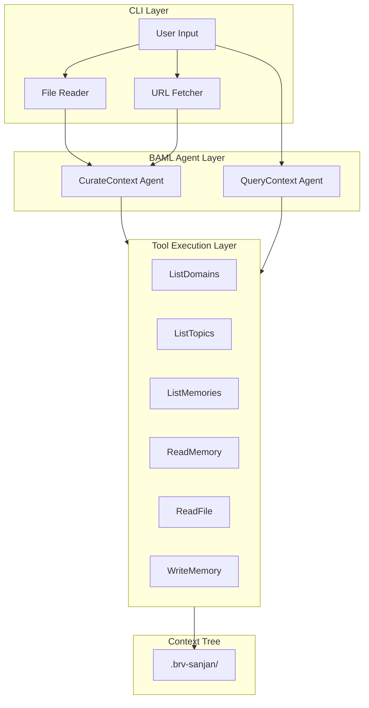

# BAML Agent Interface for brv-sanjan

## Summary

Design two BAML agent functions (`CurateContext` and `QueryContext`) that use tool-calling to navigate the context tree and codebase. The agent will iteratively call tools until it has gathered enough information to make a decision.

## Curate Command - Input Analysis

From [docs/USER_EXPERIENCE.md](docs/USER_EXPERIENCE.md), the `curate` command accepts:| Input Type | Source | What gets passed to BAML ||------------|--------|--------------------------|| Direct text | `brv-sanjan curate "text"` | Raw string content || File import | `--from-file ./docs/arch.md` | File contents as string || URL import | `--url https://...` | Fetched page content as string || Domain/topic hints | `--domain X --topic Y` | Optional categorization hints |All sources ultimately resolve to **text content** before reaching BAML. The CLI layer handles file reading and URL fetching.---

## Architecture Overview



---

## BAML Types and Functions

### 1. Tool Definitions (Distinct Classes)

Each tool is a separate class with only its required arguments:

```baml
// Tool to list all domains in the context tree
class ListDomainsTool {
  toolName "ListDomains"
}

// Tool to list all topics within a specific domain
class ListTopicsTool {
  toolName "ListTopics"
  domain string @description("The domain to list topics from")
}

// Tool to list all memory files within a domain/topic
class ListMemoriesTool {
  toolName "ListMemories"
  domain string @description("The domain containing the topic")
  topic string @description("The topic to list memories from")
}

// Tool to read the content of a specific memory file from the context tree
class ReadMemoryTool {
  toolName "ReadMemory"
  domain string @description("The domain containing the memory")
  topic string @description("The topic containing the memory")
  filename string @description("The memory filename to read")
}

// Tool to read source code files from the project codebase (not the context tree)
class ReadFileTool {
  toolName "ReadFile"
  path string @description("Path to the source file to read, relative to project root")
}

// Tool to write or update a memory file in the context tree
class WriteMemoryTool {
  toolName "WriteMemory"
  action "create" | "update" @description("Whether to create a new memory file or update an existing one")
  domain string @description("The target domain for the memory")
  topic string @description("The target topic within the domain")
  filename string @description("The memory filename without extension")
  content string @description("The markdown content to write")
}

// Shared tools (read-only navigation)
type SharedTool = ListDomainsTool | ListTopicsTool | ListMemoriesTool | ReadMemoryTool | ReadFileTool

// Curate completion - signals successful curation
class CurateDoneTool {
  toolName "Done"
}

// Query completion - returns retrieved context and summary
class QueryDoneTool {
  toolName "Done"
  results RetrievedContext[] @description("Retrieved context pieces that answer the query")
  summary string @description("Synthesized answer from the retrieved context")
}

class RetrievedContext {
  domain string
  topic string
  filename string
  relevantContent string @description("The specific excerpt that answers the query")
}

// Tools available to CurateContext agent
type CurateTool = SharedTool | WriteMemoryTool | CurateDoneTool

// Tools available to QueryContext agent (no write access)
type QueryTool = SharedTool | QueryDoneTool
```

**Tool Access Summary:**| Tool | CurateContext | QueryContext ||------|:-------------:|:------------:|| ListDomainsTool | ✓ | ✓ || ListTopicsTool | ✓ | ✓ || ListMemoriesTool | ✓ | ✓ || ReadMemoryTool | ✓ | ✓ || ReadFileTool | ✓ | ✓ || WriteMemoryTool | ✓ | ✗ || CurateDoneTool | ✓ | ✗ || QueryDoneTool | ✗ | ✓ |**Tool Distinction:**

- `ReadMemoryTool`: Reads from the context tree (`.brv-sanjan/{domain}/{topic}/{file}.md`)
- `ReadFileTool`: Reads source code files from the project codebase (not the context tree)

### 2. CurateContext Function

```baml
function CurateContext(
  content: string,
  domainHint: string?,
  topicHint: string?,
  contextTreeStructure: string,
  toolResults: ToolResult[]
) -> CurateTool {
  client "anthropic/claude-haiku-4-5-20251001"
  prompt #"
    ... (curate agent instructions)
  "#
}
```

The agent outputs a single tool per call. When it outputs `WriteMemoryTool`, the CLI writes the memory. When it outputs `CurateDoneTool`, the loop ends.

### 3. QueryContext Function

```baml
function QueryContext(
  query: string,
  domainFilter: string?,
  contextTreeStructure: string,
  toolResults: ToolResult[]
) -> QueryTool {
  client "anthropic/claude-haiku-4-5-20251001"
  prompt #"
    ... (query agent instructions)
  "#
}
```

When the agent outputs `QueryDoneTool`, the loop ends and the `results` and `summary` fields contain the final answer.

### 4. Shared Types

```baml
// Result from executing a tool, passed back to the agent
class ToolResult {
  toolName string @description("Name of the tool that was executed")
  input string @description("The input that was passed to the tool")
  output string @description("The output from executing the tool")
}
```

---

## Agent Loop Implementation (TypeScript Example)

> **Note:** This is a minimal reference example showing the general agent loop pattern. Implementation details (error handling, max iterations, etc.) will be specified separately.The BAML functions return tools directly; the CLI executes them and loops:

```typescript
import { b } from './baml_client';
import { CurateTool, QueryTool, ToolResult, RetrievedContext } from './baml_client/types';

async function runCurateAgent(
  content: string,
  domainHint: string | null,
  topicHint: string | null
): Promise<void> {
  const contextTreeStructure = getContextTreeStructure();
  const toolResults: ToolResult[] = [];

  while (true) {
    const tool = await b.CurateContext({
      content,
      domainHint,
      topicHint,
      contextTreeStructure,
      toolResults,
    });

    if (tool.toolName === 'Done') {
      return; // CurateDoneTool - curate complete
    }

    if (tool.toolName === 'WriteMemory') {
      await writeMemory(tool.domain, tool.topic, tool.filename, tool.content, tool.action);
    }

    // Execute read tools and accumulate results
    const result = await executeTool(tool);
    toolResults.push({
      toolName: tool.toolName,
      input: serializeToolInput(tool),
      output: result,
    });
  }
}

async function runQueryAgent(
  query: string,
  domainFilter: string | null
): Promise<{ results: RetrievedContext[]; summary: string }> {
  const contextTreeStructure = getContextTreeStructure();
  const toolResults: ToolResult[] = [];

  while (true) {
    const tool = await b.QueryContext({
      query,
      domainFilter,
      contextTreeStructure,
      toolResults,
    });

    if (tool.toolName === 'Done') {
      // QueryDoneTool contains results and summary
      return { results: tool.results, summary: tool.summary };
    }

    // Execute read tools and accumulate results
    const result = await executeTool(tool);
    toolResults.push({
      toolName: tool.toolName,
      input: serializeToolInput(tool),
      output: result,
    });
  }
}
```

---

## Key Design Decisions

1. **Separate Functions**: Use separate `CurateContext` and `QueryContext` functions rather than a unified agent, as their output schemas differ significantly.
2. **Distinct Tool Classes**: Each tool is defined as its own class with only its required fields (no optional parameters), combined via a union type for type safety.
3. **Tool Results as Input**: Pass accumulated tool results back to the agent on each iteration, allowing it to build context incrementally.
4. **Context Tree Structure Upfront**: Provide `contextTreeStructure` (domains/topics listing) upfront to minimize tool calls for basic navigation.
5. **Haiku 4.5**: Use `anthropic/claude-haiku-4-5-20251001` for cost-effective structured extraction.
6. **Markdown Output for Curate**: The agent generates the final markdown content directly, ready to write to disk.

---

## Files to Create

### `baml_src/context_agent.baml`

This file contains all agent-related types and functions:

1. **Tool Classes**: All tool definitions (`ListDomainsTool`, `ListTopicsTool`, etc.)
2. **Shared Types**: `ToolResult`, `RetrievedContext`
3. **Union Types**: `SharedTool`, `CurateTool`, `QueryTool`
4. **Functions**: `CurateContext` and `QueryContext` with placeholder prompts

---

## Context Tree Structure Format

The `contextTreeStructure` parameter uses a simple tree-like text representation:

```javascript
.brv-sanjan/
├── Architecture/
│   ├── System-Design/
│   │   └── microservices.md
│   └── Database/
│       └── schema-design.md
├── API/
│   ├── Authentication/
│   │   ├── jwt-implementation.md
│   │   └── oauth-flow.md
│   └── Endpoints/
│       └── rest-conventions.md
└── Frontend/
    ├── Components/
    │   └── react-patterns.md
    └── State-Management/
        └── redux-usage.md


```